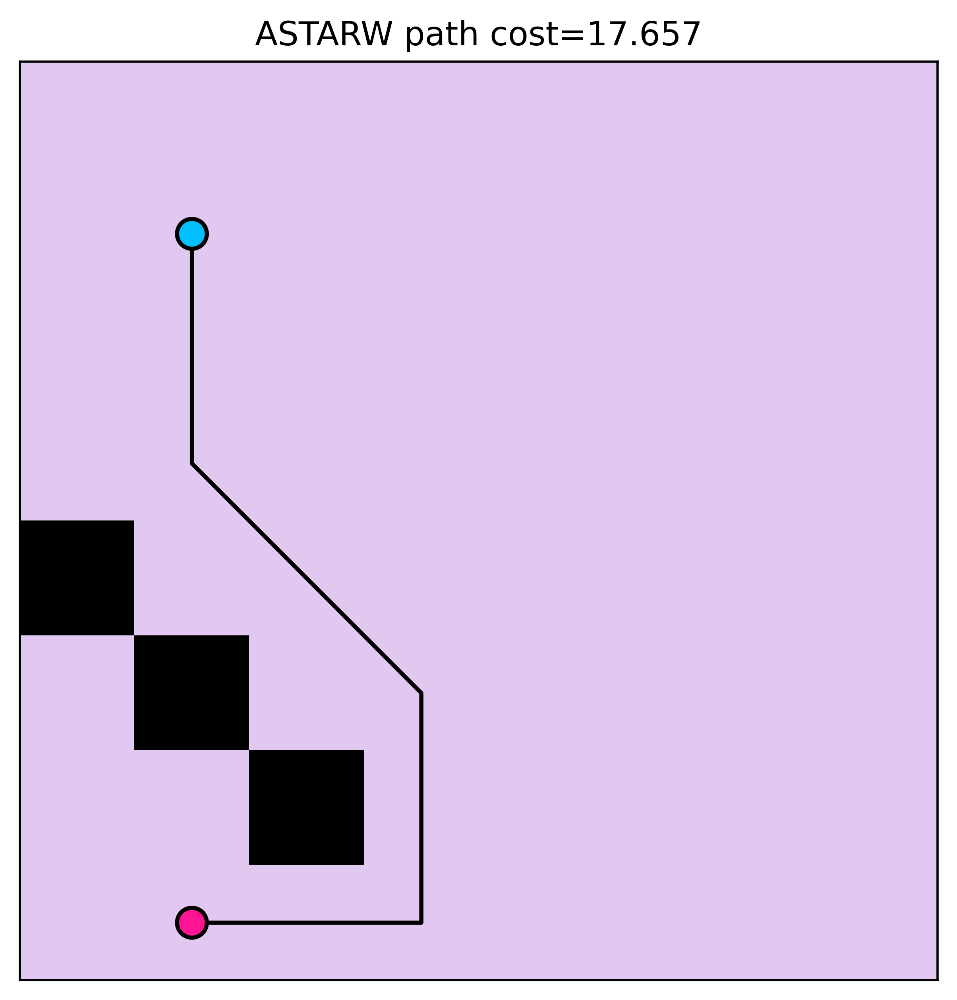
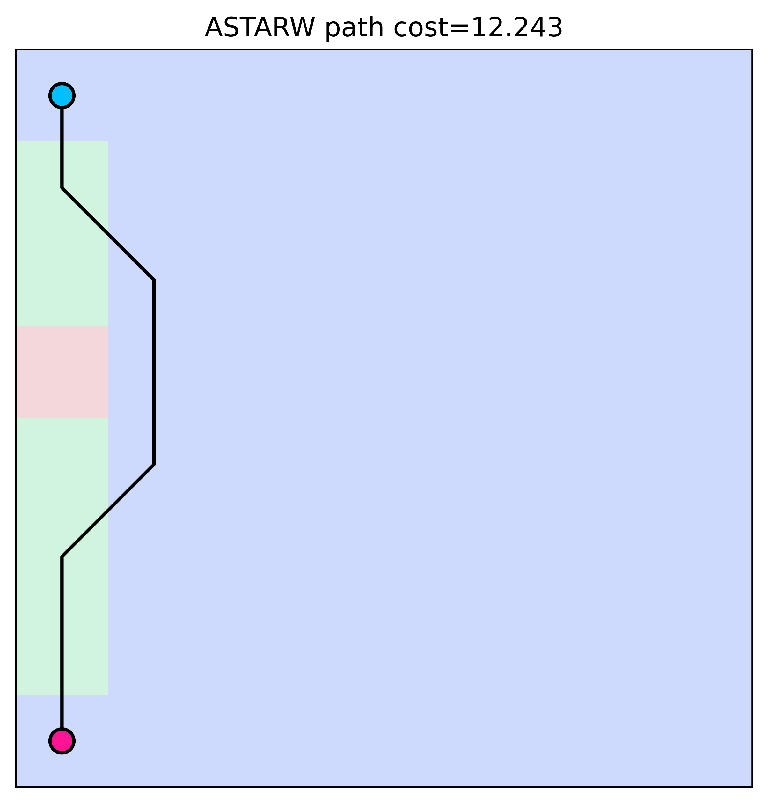

# Алгоритмы сокращения пространства поиска на графе регулярной декомпозиции за счет симметрии и смежных техник (JPS и его модификации)

## Необходимо реализовать базовый алгоритм JPS  [Harabor and Grastien, 2014], [Rabin and Sturtevant, 2016], опционально реализовать его улучшение из статьи  [Harabor and Grastien, 2014]. Далее реализовать версию алгоритма для поиска путей на графах-сетках с различным типом (и стоимостью) клеток [Carlson et al, 2023]

- Команда 2 человека: Денисов Никита и Васильев Егор
- Все статьи находятся в папке [papers](papers/)

## [Презентация КТ №1](https://docs.google.com/presentation/d/12X5laVY5Llpda4JvgQLUZ1vzJgyGd83-QKXvEm5NzWQ/edit?slide=id.g3a19b4d6b3b_1_96#slide=id.g3a19b4d6b3b_1_96)

## Инструкция по установке

```
git clone https://github.com/SPBU-study/heuristic-search-2025-fall.git
cd heuristic-search-2025-fall
pip install .
```

## Команда запуска cli

```
cd JPS
python -m pathfinding.cli --map <path-to-map> --start-x <start-x> --start-y <start-y> --goal-x <goal-x> --goal-y <goal-y> --algorithm <algorithm> --visualize
```

## Пример работы


### Обычный grid

```
python -m pathfinding.cli --map maps/example/grid.map --start-x 1 --start-y 1 --goal-x 1 --goal-y 7 --algorithm astarw --visualize

# output
Algorithm: ASTARW
Path cost: 17.656854
Expanded nodes: 25
Time elapsed: 0.000439 seconds
Saved visualization to: /Users/nvdenisov/study/2025-fall/HSearch/project/heuristic-search-2025-fall/JPS/assets/20251223_161116_grid_8x8.png
```



### Взвешенный grid

```
python -m pathfinding.cli --map maps/example/weighted_grid.map --start-x 0 --start-y 0 --goal-x 0 --goal-y 7 --algorithm astarw --visualize

# output
Algorithm: ASTARW
Path cost: 12.242641
Expanded nodes: 17
Time elapsed: 0.000436 seconds
Saved visualization to: /Users/nvdenisov/study/2025-fall/HSearch/project/heuristic-search-2025-fall/JPS/assets/20251223_161351_grid_8x8.png
```

Веса у соотвествующих цветов
- синий — 2
- зеленый — 1
- красный — 30


